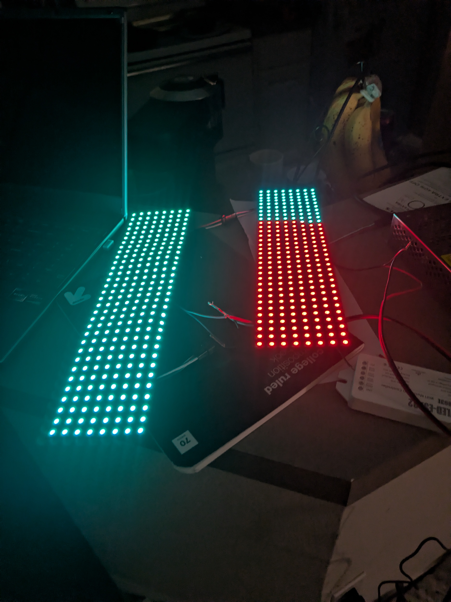

# WrangLED

> 512 LEDs. Discord commands. 15 days. Built live for PyTexas 2026.

WrangLED is a Discord-controlled IoT LED matrix built as a community project for PyTexas 2026 (April 17–19, Austin Central Library). Virtual and in-person attendees type a `/led` command in Discord and the matrix reacts in real time — colors, text, animations, and presets.

This repo is the full monorepo: FastAPI hub, Pi wrangler agent, React dashboards, shared Pydantic contracts, infra scripts, and the [talk slides](./presentation/slides-talk.md).

**📺 Watch the talk:** [WrangLED lightning talk at PyTexas 2026 →](https://youtu.be/STGlXoMyhRU?t=1381) (~5 min, jumps to the demo)

**🛠️ Want to build your own? Start at [Build Your Own](#build-your-own).**

---

## The Story

*One meetup. One idea. Fifteen days.*

| Date | Event |
|------|-------|
| **May 2025** | Jesse joins PyTexas Community Committee |
| **Oct 2025** | AI Night concept born after Jeff Triplett's RAG talk |
| **Jan 2026** | PyTexas AI Night monthly lightning talk series launches |
| **Mar 25, 2026** | Jim (CowboyQuant) presents *Lumbergh* at AI Night — "Talk of the season 🏆" |
| **Apr 2, 2026** | WrangLED concept born at DFW Pythoneers Meetup in Plano |
| **Apr 6, 2026** | Hardware arrives. First LED panel lights up at **2:17 AM** 🔥 |
| **Apr 17–19, 2026** | PyTexas 2026 — live demo on the conference floor |

*"What if virtual attendees could control the LEDs?"*

Jesse and Jim had met exactly once — at the meetup where this idea sparked. They built the entire project over Discord. No calls. No meetings. Just chat, commits, and late nights. Jesse handled hardware, infrastructure, and the Pi; Jim wrote the FastAPI hub, Discord bot, and React dashboards. Shared Pydantic contracts let them develop in parallel without schema drift.

**8 days of active building. 165 commits. 70 commits on a single Monday.**

---

## The Wi-Fi Crisis (and the Pivot)

The original architecture (V1) routed Discord commands through a VPS hub, tunneled via WebSocket to the Pi over Tailscale — bypassing venue NAT entirely. It worked perfectly at home.

At PyTexas, the Austin Central Library Wi-Fi enforced client isolation: devices on the same network couldn't talk to each other, severing the Pi-to-WLED connection. A Pixel 8a hotspot fallback couldn't handle two ESP32s racing through the WPA handshake simultaneously.

**Jesse acquired a USB WiFi dongle the morning of the conference.** Jim configured the Pi as a private access point using `hostapd` + `dnsmasq`. The Pi became the router. No client isolation. No WPA race conditions. Attendees connected directly to the Pi's network and controlled the LEDs from their phones — zero cloud, zero subscriptions.

```
V1 (what shipped)          V2 (conference pivot)
─────────────────          ─────────────────────
Discord                    Phone browser
    ↓                           ↓
FastAPI Hub (VPS)          FastAPI Wrangler (Pi)
    ↓ WebSocket                 ↓
Pi Wrangler (Tailscale)    WLED firmware (ESP32)
    ↓                           ↓
WLED firmware              LED matrix
```

---

## Architecture

```
Discord bot ──────────────────────┐
Dashboard PWA ────────────────────┤
                                  ↓
                         FastAPI Hub (api)
                         command bus · auth
                                  │
                          WebSocket tunnel
                        (Pi dials out — no
                         inbound port needed)
                                  │
                         wrangler on Pi
                         FastAPI agent
                                  │
                     ┌────────────┴────────────┐
                     ↓                         ↓
               WLED panel 1             WLED panel 2
              (ESP32 SP803E)           (ESP32 SP803E)
```

**Key design decisions:**

- `wrangler` is outbound-only — it dials home to `api` and holds the WebSocket open. The Pi never needs a public port or port forwarding, making venue firewalls irrelevant.
- Shared `packages/contracts` (Pydantic v2) means schema changes break the build, not production. This enabled parallel development between Jesse and Jim without coordination overhead.
- `systemd` service on the Pi auto-restarts `wrangler` on crash. UFW firewall: only ports 22 (SSH) and 8501 (wrangler) open.

### Monorepo Layout

```
wrangled-dashboard/
├── apps/
│   ├── api/          # FastAPI hub — command bus, Discord queue, auth  (port 8500)
│   ├── wrangler/     # FastAPI + agent on Pi, dials home, pushes to WLED (port 8501)
│   ├── dashboard/    # Vite/React operator "Command Center" PWA         (port 8510)
│   └── wrangler-ui/  # Vite/React local config panel on Pi              (port 8511)
├── packages/
│   └── contracts/    # Shared Pydantic v2 models
├── infra/            # Docker Compose + Pi systemd install scripts
└── presentation/     # Slidev talk slides
```

---

## Engineering Highlights

The problems worth talking about — and how we solved them on a 15-day clock:

- **Outbound-only tunnel.** The Pi dials home over WebSocket and holds the connection open, so there's no inbound port or port-forwarding to configure. Venue firewalls and NAT stop mattering.
- **Schema-safe parallel development.** Shared Pydantic v2 `contracts` turn a breaking change into a failed build, not a production incident. Two developers shipped producer and consumer in parallel with zero schema-sync meetings.
- **`/panic` kill switch.** Shipped ~4 minutes after a stranger discovered `/led text` — a one-command blackout for when an open demo gets too creative.
- **Discord's 25-choice cap.** Preset pickers blew past Discord's hard limit on slash-command choices; solved live with autocomplete instead of a static list.
- **Resilient pushes.** Conference-hall Wi-Fi drops packets, so WLED writes retry with backoff rather than failing the command outright.
- **Async fan-out.** A single event loop serves the Discord gateway and pushes to both ESP32s concurrently — no blocking on one slow panel.

---

## Hardware Bill of Materials

Everything shipped from Amazon. Total build cost: ~$120.

| Component | What it does | Link |
|-----------|-------------|------|
| **Raspberry Pi 4 Model B (4GB)** | Central controller — hosts wrangler agent, runs the AP in V2 | [Amazon →](https://www.amazon.com/dp/B07D3S4KBK) |
| **BTF-LIGHTING SP803E** (ESP32, WLED pre-installed) | Translates HTTP/JSON commands into 800 kHz WS2812B data signal | [Amazon →](https://www.amazon.com/dp/B0FB38FDCS) |
| **BTF-LIGHTING 8x32 WS2812B LED Matrix × 2** | 256 pixels each, daisy-chained for 512 LEDs total (8×64 display) | [Amazon →](https://www.amazon.com/dp/B09XWR1Y5K) |
| **5V 20A 100W Switching PSU** | Powers the Pi and both LED panels | [Amazon →](https://www.amazon.com/dp/B07KC55TJF) |
| **NETGEAR A6150 USB WiFi Dongle** | Second radio for Pi — dedicated access point in V2 | [Amazon →](https://www.amazon.com/NETGEAR-AC1200-WiFi-USB-Adapter/dp/B07P388DBG) |

> [!WARNING]
> **Check your matrix config before you rewire anything.** During our late-night session, only one panel lit up. The WLED strip length was set to 256 (one panel) instead of 512 (both). Always verify `LED count` in WLED settings before touching data lines.

**Wiring notes:**
- 5V/GND from PSU → both panels (split red/black 22 AWG)
- Data line: Pi → SP803E → Panel 1 data-in → Panel 1 data-out → Panel 2 data-in (daisy chain)
- SP803E is Wi-Fi only — it does not connect to the Pi directly. The Pi POSTs HTTP/JSON to the ESP32's WLED API over Wi-Fi.

---

## Discord Commands

| Command | Effect |
|---------|--------|
| `/led color #ff6600` | Set all LEDs to a hex color |
| `/led text hello` | Scroll text across the matrix |
| `/led preset <name>` | Load a named preset (10 built-in) |
| `/led effect <name>` | Run a WLED animation effect |
| `/led on` / `/led off` | Power the matrix on or off |
| Emoji reactions | Trigger mapped presets |

Built-in presets: `talk_starting`, `talk_soon`, `breaktime`, `talk_live`, `lightning`, `lunch`, `networking`, `silent_phones`, `idle`, `applause`

---

## Build Your Own

This stack is replicable in a weekend. Here's the short version:

### 1. Flash WLED onto the SP803E

The SP803E ships with WLED pre-installed. Connect it to your home Wi-Fi via the WLED AP (`WLED-AP` network on first boot), then set it up through the WLED web UI. Set LED count to `512` and matrix width to `64`.

### 2. Set up the Pi

```bash
# Install uv (Python package manager)
curl -LsSf https://astral.sh/uv/install.sh | sh

# Clone the repo
git clone https://github.com/JesseFlip/wrangled-dashboard
cd wrangled-dashboard

# Install Pi-side dependencies
cd apps/wrangler
uv sync

# Copy and edit config
cp .env.example .env
# Set WLED_HOST to your SP803E's IP
```

### 3. Run the wrangler agent

```bash
# One-time: install as a systemd service
sudo cp infra/wrangler.service /etc/systemd/system/
sudo systemctl enable --now wrangler

# Or run directly for dev
uv run uvicorn main:app --port 8501
```

### 4. Run the API hub (on a VPS or locally)

```bash
cd apps/api
uv sync
uv run uvicorn main:app --port 8500
```

### 5. Set up Discord bot

Create a Discord application, add a bot, and set `DISCORD_TOKEN` + `DISCORD_GUILD_ID` in `apps/api/.env`. The bot auto-registers slash commands on startup.

### V2 (Conference mode — Pi as router)

If your venue has client isolation (or no Wi-Fi at all):

```bash
# Install hostapd and dnsmasq
sudo apt install hostapd dnsmasq

# Use the infra scripts
sudo bash infra/setup-ap.sh
```

This turns the Pi into a private 192.168.4.x access point. Guests connect to it and reach the dashboard at `192.168.4.1:8511`. No internet required.

---

## Running Locally (Full Stack)

```bash
# Start everything with Docker Compose
docker compose up

# Or individually:
cd apps/api    && uv run uvicorn main:app --reload --port 8500
cd apps/wrangler && uv run uvicorn main:app --reload --port 8501
cd apps/dashboard && npm run dev  # port 8510
```

Python 3.11+ required. Use `uv` — it's in the CLAUDE.md conventions and handles the `packages/contracts` workspace dependency automatically.

---

## The Talk

📺 **Watch it:** [WrangLED at PyTexas 2026 — Day 1 Lightning Talks](https://youtu.be/STGlXoMyhRU?t=1381) (link jumps straight to the WrangLED segment).

The Slidev slide deck is at [`presentation/slides-talk.md`](./presentation/slides-talk.md). Run it with:

```bash
cd presentation
npm install
npx slidev slides-talk.md      # live presenter view at http://localhost:3030
```

Slides cover: the 15-day sprint story, architecture, the Wi-Fi crisis pivot, and live demo instructions.

---

## The Build-Log Dashboard

Beyond live LED control, this repo also contains a React + Vite **Command Center** (`apps/dashboard`) that served as the project's interactive build log and project-management dashboard during the sprint — tracking progress across the 15 days toward PyTexas 2026.



*(If the image doesn't render, drop the latest dual-panel photo into `public/` as `both_panels_lit.jpg`.)*

---

## The Team

| Person | Role |
|--------|------|
| **Jesse Flippen** | Hardware, infrastructure, Pi, conference logistics, Community Committee Chair |
| **Jim Vogel** (`@CowboyQuant`) | FastAPI hub, Discord bot, React dashboards, Pydantic contracts |
| **Kevin** | Discord bot deployment on Mason's VPS, FastAPI integration |
| **Mason Egger** | PyTexas President, VPS host, deadline enforcer |

Built with Python, FastAPI, React, WLED, Tailscale, and Claude.

WrangLED isn't just a hardware project. It's what happens when the Python community builds something together — open-source, built live, and bridging virtual and in-person attendees.
