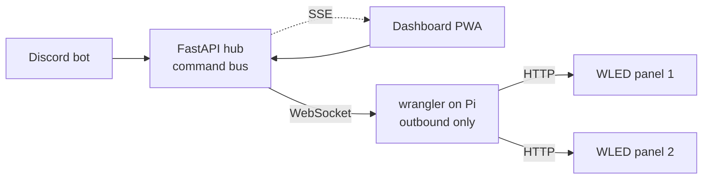

<div class="absolute inset-0 bg-black/70"></div>

<div class="relative z-10 pt-6">

# Before I start — open your phone.

<div class="pt-4 text-3xl">
Join the Discord → type <code>/led text hello</code>
</div>

<div class="pt-4 text-lg opacity-85">
The matrix behind me is already listening.<br/>
Send anything. We'll come back to it.
</div>

<div class="pt-8 flex items-center justify-center gap-8">
  
  <div class="text-left">
    <div class="text-xl opacity-90">Scan → the WrangLED Discord</div>
    <div class="text-sm opacity-70">discord.gg/mH7Fb9HE</div>
  </div>
</div>

<div class="pt-6 text-sm opacity-70 italic">
(Yes, this means strangers get to mess with my slides for the next hour. That's the whole point.)
</div>

</div>

<!--
SPEAKER: Start the demo BEFORE you say anything else. Get hands on phones immediately —
that physical action is the hook. Confirm the QR/invite points at the room's live server,
not the original PyTexas one. Leave the panel visible the whole talk; reference it whenever
someone sends something fun. Don't explain how it works yet — just let it be magic for now.
-->

---
layout: default
background: /img/title-bg.png
class: text-white text-center
---

<div class="absolute inset-0 bg-black/70"></div>

<div class="relative z-10">

# WrangLED

## We built a Discord-controlled LED matrix in 15 days.
## Most of it worked.

<div class="pt-8 text-lg opacity-90">
Jesse Flippen · PyTexas Community Committee
</div>

<div class="pt-2 text-sm opacity-70">
built with Jim Vogel (<code>@CowboyQuant</code>) · first demoed at PyTexas 2026
</div>

</div>

<!--
SPEAKER: One sentence on who you are — PyTexas Community Committee, you organize AI Night.
Set the promise of the talk: "By the end you'll know exactly how to build your own, and the
README has every link." This is a hiring-relevant talk; you're showing how you ship under
constraints, not just what blinks.
-->

---
layout: image-right
image: /img/conference.jpg
class: !text-left
---

# How this started

<div class="pt-1 text-xs">

| When | What |
|------|------|
| **May 2025** | I join the PyTexas Community Committee |
| **Oct 2025** | AI Night idea sparks after Jeff Triplett's RAG talk |
| **Jan 2026** | PyTexas AI Night lightning-talk series launches |
| **Mar 2026** | Jim demos *Lumbergh* at AI Night — talk of the season 🏆 |
| **Apr 2** | WrangLED idea sparks at the DFW Pythoneers meetup |
| **Apr 6** | Hardware arrives. First panel lights up at **2:17 AM** |
| **Apr 17–19** | Live demo on the floor at PyTexas 2026 |

</div>

<div class="pt-3 text-sm opacity-70 italic">
From idea to demo: fifteen days.
</div>

<!--
SPEAKER: The point of this slide is momentum, not dates. The community came first — the
hardware project grew out of relationships built over a year. Land the contrast: a year of
community, then fifteen frantic days of building.
-->

---
layout: image-right
image: /img/conference.jpg
class: !text-left
---

# The ask

> *"What if virtual attendees could **control the LEDs** in the room?"*

<div class="pt-4 space-y-2 text-sm">

- PyTexas is hybrid — half the audience is remote
- A wall of LEDs the whole room can drive bridges the gap
- Discord is where the community already lives
- So: type a command, the matrix reacts. In real time. From anywhere.

</div>

<div class="pt-6 opacity-70 italic">
Fifteen days to figure out the rest.
</div>

<!--
SPEAKER: Frame the *problem* before the tech. Hybrid conferences have a participation gap —
remote attendees watch, they don't act. WrangLED is a tiny fix for a real community problem.
That framing is what makes this a project worth copying, not just a toy.
-->

---
layout: image
image: /img/hero-panels.jpg
class: text-white
---

<div class="absolute inset-0 bg-gradient-to-t from-black/85 via-black/20 to-transparent"></div>

<div class="absolute bottom-10 left-10 right-10">

# First light 🔥

<div class="text-xl opacity-90">
2:17 AM. A kitchen table in DFW. The power supply held.
</div>

<div class="pt-3 text-base opacity-75">
Only one panel lit up. <i>"Must be your wiring."</i> &nbsp;Reader, it was a config flag.
</div>

</div>

<!--
SPEAKER: This is the emotional high point of the build. Tell it like a story — the late night,
the doubt, the relief. Foreshadow the gotcha (it was the LED-count setting, not the soldering)
because you'll pay it off in the hardware section. Keep it short; let the photo do the work.
-->

---
layout: image-left
image: /img/build-night.png
class: !text-left
---

# Two developers. One Discord server.

<div class="pt-2 space-y-3 text-sm">

- Jim and I had met **once** — at the meetup where the idea was born
- We built the **entire project over Discord.** No calls. No meetings.
- **My half:** the Pi, Linux, hardware, networking, Tailscale, the access point, conference logistics
- **Jim's half:** the FastAPI hub, the Discord bot, the React dashboards
- Shared **Pydantic contracts** meant a schema change broke the *build*, not production

</div>

<div class="pt-5 text-base opacity-90 italic">
8 days of active building. 165 commits. 70 on a single Monday.
</div>

<!--
SPEAKER: Be honest about the split — you owned hardware and infrastructure, Jim owned the
application layer. That honesty is what makes the next point land: two strangers built a working
distributed system async, over chat, because they agreed on the *interface* first. That's the
transferable lesson. Don't oversell what you didn't write; the impressive part is the seam.
-->

---
layout: section
background: /img/bg-gradient.jpg
class: text-white text-center
---

# How it actually works

<div class="pt-2 text-lg opacity-80">
Three moving parts, one clean seam between them.
</div>

<!--
SPEAKER: Transition. You've told the story; now you teach the system. Everything from here is
"how you could build this too." Slow down — this is the part the audience came to copy.
-->

---
layout: default
background: /img/architecture-bg.png
class: text-white
---

<div class="absolute inset-0 bg-black/60"></div>

<div class="relative z-10">

# Architecture



<v-clicks>

- **Three moving parts:** WLED firmware · `wrangler` on the Pi · `api` hub.
- **The Pi dials home.** Opening a port on conference Wi-Fi is a dare, not a plan.
- **🏆 Contracts decided up front paid for themselves every single day.**

</v-clicks>

</div>

<!--
SPEAKER: Walk the arrows left to right. Producers (Discord, dashboard) drop commands into the
hub; the hub fans them to the Pi over a WebSocket the Pi opened; the Pi speaks HTTP to the LEDs.
Plant the two ideas you'll expand next: dial-home, and contracts. Don't rush the clicks.
-->

---
layout: default
class: !text-left
---

# Part 1 — WLED on the ESP32

<div class="grid grid-cols-2 gap-8 pt-2">

<div class="space-y-3 text-sm">

- The **SP803E** is an ESP32 with **WLED** firmware pre-installed
- WLED exposes an **HTTP/JSON API** — `POST` a payload, the pixels change
- It drives the WS2812B data line at **800 kHz** so we don't have to
- We never wrote firmware. We send it JSON.

```json
{ "seg": [{ "col": [[255, 102, 0]] }], "on": true }
```

</div>

<div class="flex items-center justify-center">
  
</div>

</div>

<!--
SPEAKER: The big unlock for the audience: you do NOT need to write embedded code. WLED is a
mature open-source firmware with a clean HTTP API. Your whole job becomes "send the right JSON."
That lowers the barrier to entry enormously — say so explicitly.
-->

---
layout: default
class: !text-left
---

# Part 2 — the `wrangler` on the Pi

<div class="pt-2 space-y-3 text-sm">

- A small **FastAPI agent** running on the Raspberry Pi
- On boot it **dials home** to the hub and holds a WebSocket open
- Receives commands, translates them, **POSTs JSON to the WLED panels** over Wi-Fi
- Runs as a **`systemd` service** — auto-restarts on crash
- Locked down with **UFW**: only ports 22 (SSH) and 8501 (local config UI) open

</div>

<div class="pt-5 text-base opacity-80 italic">
This was my half. The Pi is the bridge between "the internet" and "the lights."
</div>

<!--
SPEAKER: This is your domain — go a little deeper here, it's where you shine. Emphasize the
operational maturity: systemd for resilience, UFW for a tight surface. Note the SP803E is
Wi-Fi-only — the Pi talks to it over the network, not a wire. That surprises people.
-->

---
layout: default
class: !text-left
---

# Part 3 — the hub, and the dial-home trick

<div class="pt-2 grid grid-cols-2 gap-8">

<div class="space-y-3 text-sm">

The **`api` hub** is a FastAPI command bus. Discord, the dashboard, any client drops a command in. It fans them out.

**The trick:** the Pi opens the connection *outbound*.

- No inbound port on the Pi
- No port-forwarding
- No router config
- Venue firewalls and NAT stop mattering

</div>

<div class="space-y-3 text-sm">

```text
            Pi ───dials out──▶ Hub
            Pi ◀──commands──── Hub
              (one WebSocket,
               held open)
```

Same pattern as `ngrok`, a CI runner, or your printer phoning home. **Outbound is almost always allowed.**

</div>

</div>

<!--
SPEAKER: This is the single most reusable idea in the talk. Anyone deploying a device behind a
firewall they don't control hits this. The fix isn't fighting the firewall — it's flipping who
initiates. Make sure everyone leaves understanding why outbound-only is the move.
-->

---
layout: image-right
image: /img/code.jpg
class: !text-left
---

# The seam — shared Pydantic contracts

<div class="pt-2 space-y-3 text-sm">

- One package, `packages/contracts`, **Pydantic v2 models**
- Imported by every Python app — hub, wrangler, bot
- A command is a **typed object**, not a loose dict
- Change the schema? The **build breaks**, not production
- Jim and I developed **in parallel**, never syncing schemas by hand

</div>

<div class="pt-4 text-base opacity-90 italic">
Two strangers, zero meetings, no schema drift. The contract was the meeting.
</div>

<!--
SPEAKER: This is the hiring-relevant systems-design point. When you can't coordinate (different
people, time zones, no meetings), you coordinate through a typed interface instead. Frame it as
the thing that made async, meeting-free collaboration actually work. It's the quiet hero.
-->

---
layout: default
class: !text-left
---

# The Discord bot

<div class="pt-2 grid grid-cols-2 gap-8 text-sm">

<div class="space-y-2">

**Slash commands** the whole room can use:

| Command | Effect |
|---------|--------|
| `/led color #ff6600` | Set a hex color |
| `/led text hello` | Scroll text |
| `/led preset <name>` | Load a preset |
| `/led effect <name>` | Run an animation |
| `/led on` · `/led off` | Power toggle |

</div>

<div class="space-y-3">

**Two things bit us:**

- 🤖 **Discord caps slash choices at 25.** Our presets blew past it — fixed live with **autocomplete**.
- 🛑 **`/panic`** — a one-command blackout, shipped ~4 min after a stranger found `/led text`.

10 built-in presets: `talk_live`, `breaktime`, `lightning`, `applause`, `silent_phones`…

</div>

</div>

<!--
SPEAKER: This is Jim's code — credit him. The lesson for builders: an open demo meets a crowd,
and crowds are creative. Plan for moderation from the start (the /panic switch) and know your
platform's limits (the 25-choice cap). Real production lessons in miniature.
-->

---
layout: section
background: /img/bg-gradient.jpg
class: text-white text-center
---

# The hardware

<div class="pt-2 text-lg opacity-80">
~$120, all from Amazon, no soldering iron required to start.
</div>

<!--
SPEAKER: Transition to the physical build. This is where "I could do this" becomes concrete.
Hold up an actual panel if you brought one — props beat slides.
-->

---
layout: default
class: !text-left
---

# Bill of materials — ~$120

<div class="pt-2 text-sm">

| Component | What it does | ~Cost |
|-----------|-------------|-------|
| **Raspberry Pi 4 (4GB)** | Central controller; becomes the router in V2 | $55 |
| **BTF-LIGHTING SP803E** (ESP32 + WLED) | Turns HTTP/JSON into the WS2812B signal | $13 |
| **2× 8×32 WS2812B matrix** | 256 pixels each → **512 LEDs** (8×64) | $30 |
| **5V 20A 100W PSU** | Powers the Pi and both panels | $18 |
| **NETGEAR A6150 USB Wi-Fi dongle** | Second radio → the V2 access point | $15 |

</div>

<div class="pt-4 text-base opacity-80">
Every part is linked in the **README → Hardware Bill of Materials**. Buy the list, you're done shopping.
</div>

<!--
SPEAKER: Point people at the README — that's the artifact they take home. The dongle looks
random now; it's the hero of the conference-day pivot, so plant it. Prices are approximate;
say "about a hundred and twenty bucks" and move on.
-->

---
layout: image-right
image: /img/soldering.jpg
class: !text-left
---

# Wiring & power

<div class="pt-2 space-y-2 text-sm">

- **Power:** 5V/GND from the PSU → both panels (split red/black 22 AWG)
- **Data:** Pi → SP803E → Panel 1 in → Panel 1 out → Panel 2 in (**daisy chain**)
- The **SP803E is Wi-Fi only** — the Pi POSTs to it over the network, not a wire
- 512 pixels at full white pulls real current — **size the PSU first**

</div>

<div class="pt-4 p-3 bg-amber-500/15 border-l-4 border-amber-500 rounded text-sm">
⚠️ <b>Check your LED count before you blame the wiring.</b> Our "dead" panel was a WLED
setting — length was 256 (one panel) instead of 512. Verify <code>LED count</code> first.
</div>

<!--
SPEAKER: Pay off the 2:17 AM foreshadowing here. The lesson: when half your hardware is dark,
suspect config before you suspect solder. Most "hardware bugs" in this world are settings.
Mention power honestly — full-white 512px is the current spike that smokes undersized supplies.
-->

---
layout: default
class: !text-left
---

# WLED setup — 5 minutes, no code

<div class="pt-2 space-y-2 text-sm">

1. Power the SP803E — it broadcasts a **`WLED-AP`** Wi-Fi network on first boot
2. Join it, open the **WLED web UI**, point it at your home Wi-Fi
3. **Set LED count to `512`** and matrix width to `64` *(this is the gotcha)*
4. Note its IP — that's your `WLED_HOST`
5. Hit the HTTP/JSON API from anything that can `POST`

</div>

<div class="pt-4 text-base opacity-80 italic">
That's the entire firmware story. WLED does the hard part; you send JSON.
</div>

<!--
SPEAKER: Reinforce the no-firmware message one more time, because it's the biggest
confidence-builder for someone on the fence. Five minutes in a web UI and you have a
controllable matrix. The hard real-time signal generation is WLED's problem, not yours.
-->

---
layout: section
background: /img/onsite-bg.png
class: text-white text-center
---

<div class="absolute inset-0 bg-black/55"></div>

<div class="relative z-10">

# Conference day

<div class="pt-2 text-lg opacity-85">
Everything worked at home. Then we plugged in at the venue.
</div>

</div>

<!--
SPEAKER: Tonal shift back to drama. This section is the war story that makes the talk
memorable — and it carries the most useful real-world lesson. Slow down and enjoy it.
-->

---
layout: image-right
image: /img/numbers-bg.png
class: !text-left
---

# The numbers & the scars

<div class="pt-2 space-y-2 text-sm">

- **8 days · 165 commits · 2 panels · 0 in-person meetings**
- **70 commits on a single Monday.** I have a day job. Allegedly.
- 🛑 **`/panic`** — shipped ~4 min after `/led text` met a stranger
- 🤖 **Discord's 25-choice limit** — autocomplete, deployed live
- 📡 **Retry-on-Wi-Fi-chaos** — conference halls hate TCP
- 🧵 **Async fan-out** — one loop serving Discord *and* two WLEDs

</div>

<!--
SPEAKER: These are the war wounds — each is a 20-second story if the room is into it, or a quick
list if you're tight on time. Retry logic and async fan-out are real engineering; don't skip
them. They show the project survived contact with reality.
-->

---
layout: image-left
image: /img/friday-morning.png
class: !text-left
---

# Friday, 9 AM. Same room, finally.

<div class="pt-2 space-y-2 text-sm">

- First time **in the same room** working on this thing
- The handshake came with a **screwdriver**
- Two rigs + one deployment = **frantic config**
- Conference Wi-Fi: round one
- Time pressure turns every bug into a 10-minute bug

</div>

<div class="pt-5 text-lg italic opacity-90">
"In theory, both rigs worked."
</div>
<div class="text-sm opacity-70">
— me, hours before the talk, lying confidently
</div>

<!--
SPEAKER: The human payoff — strangers-over-Discord finally meet in person, on deadline. Keep it
light and self-deprecating. Then pivot hard into the crisis on the next slide.
-->

---
layout: two-cols
class: !text-left
---

# The venue Wi-Fi died.

<div class="pt-3 space-y-3 text-sm">

The Austin Central Library enforced **client isolation** — devices on the same network couldn't see each other. Pi → WLED: **severed.**

Fallback Pixel 8a hotspot: two ESP32s **raced the WPA handshake** at boot. The radio gave up.

</div>

<div class="pt-5 text-base font-semibold">
So we bought a USB dongle.
</div>

<div class="pt-3 text-sm opacity-80">
I grabbed a NETGEAR A6150 the morning of the conference. Jim configured the Pi as a private access point — <code>hostapd</code> + <code>dnsmasq</code>. <b>The Pi became the router.</b>
</div>

::right::

<div class="pt-10 pl-8 space-y-6 text-sm">

<div class="opacity-60 line-through">

**V1: VPS-anchored**<br/>
Discord → FastAPI hub (VPS) → Tailscale → Pi wrangler → WLED

</div>

<div class="pt-4 text-green-400 font-semibold">

**V2: Pi-as-router**<br/>
Phone → Pi AP (192.168.4.1) → wrangler → WLED

</div>

<div class="pt-4 opacity-80 italic">
No internet. No cloud. No subscriptions.<br/>
100% local execution.
</div>

</div>

<!--
SPEAKER: The single most useful lesson in the whole talk: never trust a venue network. Client
isolation is invisible until it kills you on stage. The fix — make the Pi its own access point —
is a pattern worth memorizing. With a second radio, your device IS the network. Tell people to
pack a dongle.
-->

---
layout: section
background: /img/bg-gradient.jpg
class: text-white text-center
---

# Build your own

<div class="pt-2 text-lg opacity-80">
A weekend. Two hundred lines of glue. The README has every command.
</div>

<!--
SPEAKER: This is the payoff section the talk promised in slide 2. From here, everything is
copy-paste-able. Tell people the README mirrors these exact steps so they don't have to take
notes — they can just listen.
-->

---
layout: default
class: text-white text-center
---

# What you actually need

<div class="pt-4 grid grid-cols-3 gap-4 text-left text-sm">

<div class="bg-white/10 rounded-lg p-4">
<div class="text-lg font-bold pb-2">🛒 Hardware</div>
Raspberry Pi 4 (4GB)<br/>
BTF-LIGHTING SP803E<br/>
2× 8×32 WS2812B panels<br/>
5V 20A PSU<br/>
NETGEAR A6150 dongle<br/>
<div class="pt-2 opacity-60">~$120 total</div>
</div>

<div class="bg-white/10 rounded-lg p-4">
<div class="text-lg font-bold pb-2">⚡ Software</div>
WLED pre-flashed on SP803E<br/>
FastAPI + <code>uv</code> on the Pi<br/>
Discord bot (slash commands)<br/>
React dashboard (Vite)<br/>
Pydantic contracts package
</div>

<div class="bg-white/10 rounded-lg p-4">
<div class="text-lg font-bold pb-2">📡 Key tricks</div>
Outbound WebSocket dial-out<br/>
<span class="opacity-60">(no inbound port)</span><br/>
USB dongle as AP<br/>
<span class="opacity-60">(venue Wi-Fi insurance)</span><br/>
Shared Pydantic contracts<br/>
<span class="opacity-60">(parallel dev, no drift)</span>
</div>

</div>

<!--
SPEAKER: The whole project on one slide. If someone photographs exactly one slide, let it be
this one. Then tell them the next two slides are the literal commands.
-->

---
layout: default
class: !text-left
---

# The steps — part 1

<div class="pt-2 text-sm">

**1. Flash & configure WLED** (it ships pre-installed on the SP803E)

Join `WLED-AP`, set it onto your Wi-Fi, set LED count `512`, width `64`.

**2. Set up the Pi**

```bash
curl -LsSf https://astral.sh/uv/install.sh | sh   # install uv
git clone https://github.com/JesseFlip/wrangled-dashboard
cd wrangled-dashboard/apps/wrangler
uv sync
cp .env.example .env        # set WLED_HOST to the SP803E's IP
```

</div>

<!--
SPEAKER: Don't read the commands aloud verbatim — narrate intent. "Install uv, clone the repo,
sync deps, point it at your panel's IP." The README has these exact blocks; that's the takeaway.
-->

---
layout: default
class: !text-left
---

# The steps — part 2

<div class="pt-2 text-sm">

**3. Run the wrangler agent** (on the Pi)

```bash
sudo cp infra/wrangler.service /etc/systemd/system/
sudo systemctl enable --now wrangler     # auto-restarts on crash
```

**4. Run the API hub** (VPS or local)

```bash
cd apps/api && uv sync && uv run uvicorn main:app --port 8500
```

**5. Wire up Discord**

Create a Discord app + bot, set `DISCORD_TOKEN` and `DISCORD_GUILD_ID` in `apps/api/.env`. The bot **auto-registers** its slash commands on startup.

</div>

<!--
SPEAKER: Emphasize the systemd line — that's what makes it survive a crash unattended at a
conference. And the auto-register: you don't hand-wire Discord commands, the bot publishes them
itself on boot. Small touches that separate a demo from something that runs all weekend.
-->

---
layout: default
class: !text-left
---

# V2 — when the venue Wi-Fi fails you

<div class="pt-2 space-y-3 text-sm">

Bring a second radio and make the Pi its own network:

```bash
sudo apt install hostapd dnsmasq
sudo bash infra/setup-ap.sh
```

- The Pi becomes a private **192.168.4.x** access point
- Guests join it directly and hit the dashboard at **`192.168.4.1:8511`**
- **No internet required** — the whole system runs in the room

</div>

<div class="pt-4 text-base opacity-90 italic">
This is the slide I wish someone had shown me the night before PyTexas.
</div>

<!--
SPEAKER: This is the "insurance policy" slide. Even if they never need it, knowing the Pi can be
its own AP changes how confidently you can demo anywhere. One script, and you stop depending on
networks you don't control.
-->

---
layout: default
class: !text-left
---

# What I'd tell you before you start

<div class="pt-2 space-y-3 text-base">

- **Agree on the interface first.** The contracts package let two strangers build in parallel.
- **Don't fight the firewall — dial out.** Outbound connections are almost always allowed.
- **Never trust the venue network.** Pack a dongle. Be your own router.
- **Suspect config before hardware.** Most "dead panels" are a setting.
- **Ship the kill switch early.** Open demos meet creative strangers.
- **Build in public, with the community.** The relationships came first; the project followed.

</div>

<!--
SPEAKER: This is your distilled wisdom — the slide people screenshot and the part a hiring
manager remembers. Each line is a generalizable principle, not LED-specific. Deliver it slowly,
make eye contact, let each one land.
-->

---
layout: image
image: /img/thanks-bg.png
class: text-white text-center
---

<div class="absolute inset-0 bg-black/70"></div>

<div class="relative z-10 pt-10">

# Try it. Right now.

<div class="pt-4 text-3xl">
Discord → type <code>/led text</code> anything
</div>

<div class="pt-3 text-lg opacity-80">
The matrix is behind me. It's been watching this whole time.
</div>

<div class="pt-8 flex items-center justify-center gap-10">
  <div class="flex items-center gap-3">
    
    <div class="text-left">
      <div class="text-lg">The Discord</div>
      <div class="text-sm opacity-80">discord.gg/mH7Fb9HE</div>
    </div>
  </div>
  <div class="flex items-center gap-3">
    
    <div class="text-left">
      <div class="text-lg">The code + full build guide</div>
      <div class="text-sm opacity-80">github.com/JesseFlip/<br/>wrangled-dashboard</div>
    </div>
  </div>
</div>

<div class="pt-6 text-base">
Thanks <b>Jim</b> (<code>@CowboyQuant</code>) 🤠 · the PyTexas crew · everyone pointing an LED at me right now.
</div>

<div class="pt-2 text-sm opacity-70">
📺 The original lightning talk is on YouTube — link in the README.
</div>

</div>

<!--
SPEAKER: Close the loop you opened in slide 1 — bring the live demo back to center. Two QRs:
the Discord (play now) and the repo (build later). Thank Jim explicitly and generously; the
honest co-credit reads well. Then open the floor — people will already be experimenting, so
take questions while the panel reacts behind you.
-->
